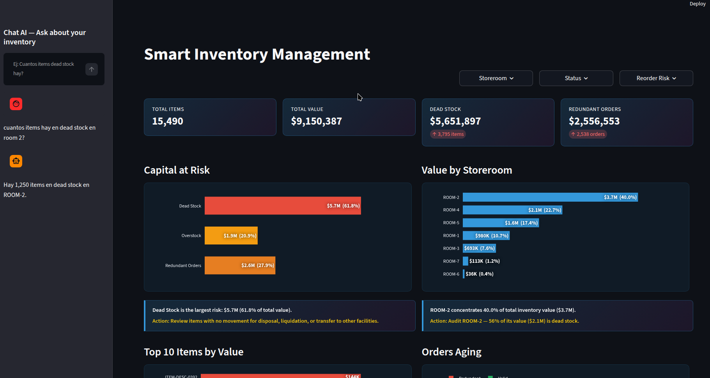

# Inventory Autopilot

A Tier 1 automotive manufacturer had **$5.6M in dead stock sitting in warehouses** — items purchased but never used. On top of that, **$2.5M in redundant purchase orders** were still open for items already overstocked. Nobody knew because the data was buried across 16,249 rows in ERP Excel exports.

**Inventory Autopilot** automates the detection: raw Excel → cleaning → analysis → SQL Server → dashboard → API → automated alerts.

## Key Findings

| Metric | Value |
|--------|-------|
| Dead stock | 3,795 items (23.4%) — **$5.6M** (61.8% of total value) |
| Overstock | 1,234 items — **$1.9M** |
| Redundant orders | 2,538 (66.6%) — **$2.5M** |
| Orders > 1 year old | 209 |

## Features

- **ETL pipeline** — Extract, clean, enrich, and load to SQL Server in one command
- **Smart dashboard** — KPIs, 5 interactive charts, and AI-generated insights per chart
- **AI chat** — Ask questions in natural language, get answers from your data (Groq + Llama 3.3 70B)
- **REST API** — 3 endpoints: health, summary, alerts with enterprise severity levels
- **Automated alerts** — n8n workflow triggers daily: checks severity → sends Gmail + Slack notifications

## Stack

| Tool | Purpose |
|------|---------|
| pandas + openpyxl | ETL and Excel export |
| SQL Server + SQLAlchemy | Database (Docker) |
| Streamlit + Plotly | Dashboard |
| Groq (Llama 3.3 70B) | AI chat (natural language → SQL) |
| FastAPI | REST API |
| n8n | Workflow automation (Gmail + Slack) |

## Documentation

- [Setup Guide](docs/SETUP.md) — Installation, configuration, and quick start
- [API Reference](docs/API_REFERENCE.md) — Endpoints, parameters, and responses
- [Architecture](docs/ARCHITECTURE.md) — System design and data flow
- [Business Rules](docs/BUSINESS_RULES.md) — Detection logic and severity thresholds

## License

MIT
